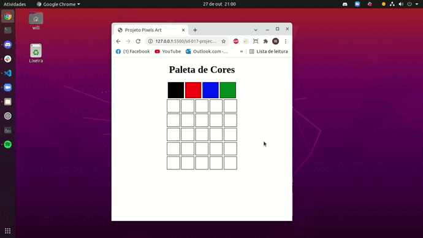

### Observação

Apenas os arquivos **script.js**, **index.html** e **style.css**, são partes do meu projeto. Outros itens do repositório foram criados pela **TRYBE**, para o funcionamento do avaliador que confere se os requisitos foram cumpridos.

Este repositório contem o Project Pixel Art que reúne o aprendizado desenvolvido por _[Willian Alves Batista](https://www.linkedin.com/in/willian-alves-batista-60aa6a180/)_ enquanto estudante da [Trybe](https://www.betrybe.com/) :rocket:

# Projeto Pixel Art
### Resultado obtido:

#### Habilidades exigidas:

  - Manipular o DOM.
  - Manipular o Javascript (funções, loop e eventos).

#### Requisitos obrigatórios:

  - Adicione à página o título "Paleta de Cores".
  - Adicione à página uma paleta de quatro cores distintas.
  - Adicione na página a cor preta ela deve ser a primeira na paleta de cores.
  - Adicione à página um quadro de pixels, com 25 pixels.
  - Faça com que cada elemento do quadro de pixels possua 40 pixels de largura, 40 pixels de altura e seja delimitado por uma borda preta de 1 pixel.
  - Definia a cor preta como cor inicial. Ao carregar a página a cor preta já deve estar selecionada para pintar os pixels.
  - Selecione uma das cores da paleta, ao clicar, a cor selecionada é a que será utilizada para preencher os pixels no quadro.
  - Clicar em um pixel dentro do quadro após selecionar uma cor na paleta, faz com que o pixel seja preenchido com a cor selecionada.
  - Crie um botão que, ao ser clicado, limpa o quadro preenchendo a cor de todos seus pixels com branco.

### Trybe

_"A Trybe é uma escola do futuro para qualquer pessoa que queira melhorar de vida e construir uma carreira de sucesso em tecnologia, onde a pessoa só paga quando conseguir um bom trabalho."_
